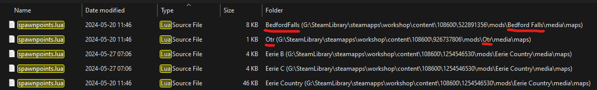

# Project Zomboid Spawnregions
This is a short writeup on how to set up spawn regions in project zomboid. I recommend using a decent text editor like one of the following to do the text editing.
- [VSCode](https://code.visualstudio.com/)
- [Notepad++](https://notepad-plus-plus.org/)
- [Sublime Text](https://www.sublimetext.com/)

This will help spot issues with the code formatting, but is not strictly necessary. Notepad will work too.

## spawnregions.lua basics
This is the main file we will be working with. When generating a server configuration. It *should* automatically be generated by project zomboid.
You will find this file, along with the rest of the server files for your configurations in the ``C:\Users\<windows-profile>\Zomboid\Server`` folder. <br>
<sub>Note, that this is not your documents folder, but the actual profile folder.</sub>

For each server configuration setup the following three files should exist.
```
<configuration_name>.ini
<configuration_name>_SandboxVars.lua
<configuration_name>_spawnregions.lua
```
The last one is the one we're interested in. Open it in a text editor of your choice.
By default it should look something along the lines of this
```lua
function SpawnRegions()
	return {
		{ name = "Muldraugh, KY", file = "media/maps/Muldraugh, KY/spawnpoints.lua" },
		{ name = "Riverside, KY", file = "media/maps/Riverside, KY/spawnpoints.lua" },
		{ name = "Rosewood, KY", file = "media/maps/Rosewood, KY/spawnpoints.lua" },
		{ name = "West Point, KY", file = "media/maps/West Point, KY/spawnpoints.lua" }
	}
end

```
We are going to populate this with spawn points from the mods we're running. It's not particularly complicated, just a smidge time-consuming. **Before we start, there is an IMPORTANT thing to keep note of:** That is the trailing comma at the end of each line except the last. The comma means that there is another line below it. So it needs to be there at the end of each line except the last one. If this is not adhered to, **the game/server might crash!**

## Finding spawnpoints.lua
Next we need to find your Project Zomboid workshop folder. 

The easiest way is to right click Project Zomboid in steam, and click ``manage`` -> ``browse local file``  

This will put you in the ``..\steamapps\common\ProjectZomboid`` folder. This isn't quite where we want to be. But its a good starting point.

Move back in the folder structure to: ``..\steamapps``

Then we want to browse to the following folder: ``\steamapps\workshop\content\108600`` <br>
<sub>The 108600 is project zomboid's game ID</sub>

Inside this folder is all the mods you're subscribed to. What we want to do next to use windows search, and search for the following term: ``spawnpoints.lua``

This should give you an output like following. (If it doesn't look like this, ensure you're view mode is set to ``Details``)



I have highlighted the information that is the most important.

## Adding to spawnregions.lua
Now with that search we should have everything we need to add spawn points to your server config. I will in the following example use BedfordFalls and Over the river (Otr) as examples. But this will work with any modded map that HAS spawn-points provided. (note that some maps simply don't, and there isn't much to do about that unless you want to add them yourself. Which is way beyond the scope of this tutorial.)

So for each mod/map you want to add, you need to know it's name. That is what the search is for. The name has to match exactly, including whitespaces for this to work. But I'm fairly sure missing/miss-spelled entries are simply ignored, and shouldn't cause issues.

You want to add the following line to the ``spawnregions.lua``

```lua
		{ name = "<mapname>", file = "media/maps/<mapname>/spawnpoints.lua" }
```
so with the two mods previously mentioned, it should look like this.
```lua
function SpawnRegions()
	return {
		{ name = "Muldraugh, KY", file = "media/maps/Muldraugh, KY/spawnpoints.lua" },
		{ name = "Riverside, KY", file = "media/maps/Riverside, KY/spawnpoints.lua" },
		{ name = "Rosewood, KY", file = "media/maps/Rosewood, KY/spawnpoints.lua" },
		{ name = "West Point, KY", file = "media/maps/West Point, KY/spawnpoints.lua" },
        { name = "BedfordFalls", file = "media/maps/BedfordFalls/spawnpoints.lua" },
        { name = "Otr", file = "media/maps/Otr/spawnpoints.lua" }
	}
end
```
<sub>Note the traling commas.</sub>

That is it. You now have spawn-points for BedfordFalls and Over the river. 

If you'd like a headstart, I have my own ``spawnregions.lua`` uploaded. You can use it as a base and add/remove whatever you need. You can find it below.

[spawnregions.lua](assets/servertest_spawnregions.lua)

## powershell script
I have also written a powershell script to automatically generate the lines.

```ps
get-childitem -Filter spawnpoints.lua -Recurse | %{$_.DirectoryName.Split("\")[-1]} | % { Write-Host "`t{ name = `""`b$_"`", file = `"media/maps/"$_"/spawnpoints.lua`" }," }
```

You want to run this in the ``..\steamapps\workshop\content\108600`` folder.

To start powershell in the folder. ``CTRL`` + ``SHIFT`` + ``Right Click`` in the folder and press ``Open PowerShell window here``

Then run the command above. **(NEVER RUN POWERSHELL COMMANDS FROM SOMEONE YOU DON'T TRUST, OR HAVE SOMEONE YOU TRUST VETTING THE SCRIPT.)**

Then copy each line to the ``spawnregions.lua`` file. (The script adds commas at the end of each line, remember to remove the last one.)